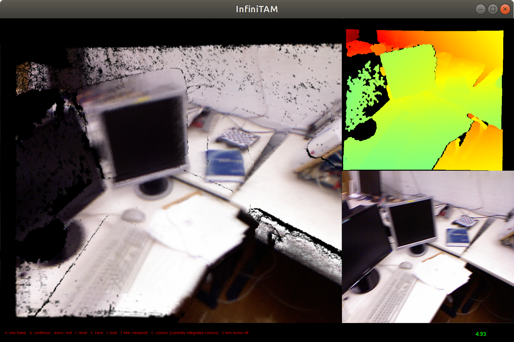

This is simply an Infinitam with ROS Interface. There are some other repos online that combine ROS with Infinitam, for example  
https://github.com/ethz-asl/infinitam  
However, I cannot make it work. 
Or  
https://github.com/victorprad/InfiniTAM/issues/140  
It says Infinitam v3.5 can work wth ROS but I didn't see it has anywhere trying to use ROS...  
Finally, I re-write the ROS interface based on the general Infinitam v3  
https://github.com/victorprad/InfiniTAM  
I recommnd you try to download the general Infinitam v3 repo and try to compile it first, If you can compile the general Infinitam v3 and you have ROS (test on melodic) then you should be able to compile this. I add the following three features to the Infinitam v3  
```
1: Accpet receiving ROS image topic  
2: Accpet External pose estimation
3: RGB reconstruction
```
# Compile
```
mkdir -p catkin_ws/src
cd catkin_ws/src
git clone https://github.com/zhaozhongch/infinitam_ros.git
cd ..
catkin_make
```
# Use
### Internal tracker
1: If you just want to use the internal tracker of the infinitam, modify the launch file. Go to the `catkin_ws/src/infinitam_ros/launch`, open `run_infinitam.launch`
```
<launch>
    <param name="name" value="ekfslam_bayesopt"/>
    <param name="use_external_pose_estimation" type="bool" value="False" />
    <!-- this line doesnt matter if you use internal trakcer -->
    <param name="external_pose_topic" type="str" value="/orbslam3/odom" />
    <param name="depth_scale" type="double" value="5000.0" />
    <param name="calib_address" type="str" value="/home/zhaozhong/dataset/tum/rgbd_dataset_freiburg1_desk/calib_infinitam.txt" />
    <param name="rgb_image_topic" type="str" value="/camera/rgb/image_raw" />
    <param name="depth_image_topic" type="str" value="/camera/depth_registered/image_raw" />
    <node name="infinitam" pkg = "infinitam" type = "InfiniTAM" output="screen">
    </node>
</launch>
```
Modify the calibration file address, the rgb image topic and the depth image topic you want to subscribe. If you want to use Infinitam to run tum rgbd dataset, please see this Q&A in the infinitam repo https://github.com/victorprad/InfiniTAM/issues/30
2: Launch
```
cd catkin_ws
source devel/setup.bash
roslaunch infinitam run_infinitam.launch
```
Then you should see the UI like the general Infinitam v3. Say I have a `rgbd_dataset_freiburg1_desk.bag` from tum rgbd. Then run the rosbag you want to play.
```
rosbag play rgbd_dataset_freiburg1_desk.bag
```
Press `c` in the UI to see colorful reconstruction  
Press `n` or `b` to see if you want to process the image one by one or continuously.  


### External Tracker
1: If you want to use external tracker, then you should create a publisher that publishes the camera pose with the same topic as the launch file `external_pose_topic`.  I provide an example combining the RGBD-ORBSLAM3 and the Infinitam.  
Download the ORBSLAM3 from its official repo https://github.com/UZ-SLAMLab/ORB_SLAM3  
2: Use the file in the `External_Tracker_Examples/ros_rgbd.cc` to replace the file in the ORBSLAM3 `Use this file to replace the ORB_SLAM3/Examples/ROS/ORB_SLAM3/src/ros_rgbd.cc` (I simply add a publisher to publish the ORBSLAM3 pose estimation)    
3: Compile ORBSLAM3 and fillowing its instruction to run the ros rgbd node. For eaxmple, if you want to run TUM RGBD dataset (https://vision.in.tum.de/data/datasets/rgbd-dataset)  
```
rosrun ORB_SLAM3 RGBD PATH_TO_VOCABULARY PATH_TO_TUM1.yaml_IN_ORBSLAM3
```
4: In infinitam launch file, change `use_external_pose_estimation` to `True`  
```
<param name="use_external_pose_estimation" type="bool" value="True" />
```
5: Run infinitam  
```
roslaunch infinitam run_infinitam.launch
``` 
6: Run TUM dataset rosbag, say `rgbd_dataset_freiburg1_desk.bag`
```
rosbag play PATH_TO_rgbd_dataset_freiburg1_desk.bag /camera/rgb/image_color:=/camera/rgb/image_raw /camera/depth/image:=/camera/depth_registered/image_raw
```

# InfiniTAM v3

This is the main branch of the software bundle "InfiniTAM", the current version is actively maintained by:

  Victor Adrian Prisacariu <victor@robots.ox.ac.uk>  
  Olaf Kaehler <olaf@robots.ox.ac.uk>  
  Stuart Golodetz <smg@robots.ox.ac.uk>  
  Michael Sapienza <michael.sapienza@eng.ox.ac.uk>  
  Tommaso Cavallari <tommaso.cavallari@unibo.it>
  
Previous maintainers and contributors are:

  Carl Yuheng Ren <carl@robots.ox.ac.uk>  
  Ming Ming Cheng <cmm.thu@gmail.com>  
  Xin Sun <xin.sun@st-hughs.ox.ac.uk>  
  Philip H.S. Torr <philip.torr@eng.ox.ac.uk>  
  Ian D Reid <ian.reid@adelaide.edu.au>  
  David W Murray <dwm@robots.ox.ac.uk>

For more information about InfiniTAM please visit the project website <http://www.infinitam.org>. 

Other related projects can be found on the AVLCode website <http://www.avlcode.org>.

# 1. Building the System

### 1.1 Requirements

Several 3rd party libraries are needed for compiling InfiniTAM. The given version numbers are checked and working, but different versions might be fine as well. Some of the libraries are optional, and skipping them will reduce functionality.

  - cmake (e.g. version 2.8.10.2 or 3.2.3)
    REQUIRED for Linux, unless you write your own build system
    OPTIONAL for MS Windows, if you use MSVC instead
    available at http://www.cmake.org/

  - OpenGL / GLUT (e.g. freeglut 2.8.0 or 3.0.0)
    REQUIRED for the visualisation
    the library should run without
    available at http://freeglut.sourceforge.net/

  - CUDA (e.g. version 6.0 or 7.0)
    OPTIONAL but REQUIRED for all GPU accelerated code
    at least with cmake it is still possible to compile the CPU part without
    available at https://developer.nvidia.com/cuda-downloads

  - OpenNI (e.g. version 2.2.0.33)
    OPTIONAL but REQUIRED to get live images from suitable hardware
    also make sure you have freenect/OpenNI2-FreenectDriver if you need it
    available at http://structure.io/openni

  - libpng (e.g. version 1.6)
    OPTIONAL, allows to read PNG input files
    available at http://libpng.org

  - FFMPEG (e.g. version 2.8.6)
    OPTIONAL, allows writing and playback of lossless FFV1 encoded videos
    available at https://www.ffmpeg.org/

  - librealsense (e.g. github version from 2016-MAR-22)
    OPTIONAL, allows to get live images from Intel Realsense cameras
    available at https://github.com/IntelRealSense/librealsense

  - librealsense2 (e.g. Intel® RealSense™ SDK 2.X)
    OPTIONAL, allows to get live images from Intel Realsense cameras
    available at https://github.com/IntelRealSense/librealsense

  - libuvc (e.g. github version from 2015-OCT-27)
    OPTIONAL, deprecated alternative to librealsense
    currently this works only with branch olafkaehler/master
    available at https://github.com/olafkaehler/libuvc

  - doxygen (e.g. version 1.8.2)
    OPTIONAL, builds a nice reference manual
    available at http://www.doxygen.org/

###1.2 Build Process

  To compile the system, use the standard cmake approach:
```
  $ mkdir build
  $ cd build
  $ cmake /path/to/InfiniTAM -DOPEN_NI_ROOT=/path/to/OpenNI2/
  $ make
```
  To create a doxygen documentation, just run doxygen:
```
  $ doxygen Doxyfile
```
  This will create a new directory doxygen-html/ containing all the
documentation.

### 1.3 Odds and Ends

Padding the data structure ITMVoxel in ITMLibDefines.h with one extra byte may or may not improve the overall performance on certain GPUs. On a NVidia GTX 680 it appears to do, on a GTX 780 it does not. Have a try yourself if you need the speed.

On Mac OS X 10.9 there are currently some issues with libc++ vs. libstdc++ in conjunction with CUDA. They eventually manifest in error messages like:
```
Undefined symbols for architecture x86_64: 
"std::ios_base::Init::Init()", referenced from:
      __GLOBAL__I_a in libITMLib.a(ITMLib_generated_ITMColorTracker_CUDA.cu.o)
      __GLOBAL__I_a in libITMLib.a(ITMLib_generated_ITMDepthTracker_CUDA.cu.o)
     [...]
```
In the current version of InfiniTAM these errors are avoided by specifying ```CMAKE_CXX_FLAGS=-stdlib=libstdc++``` whenever clang is detected as complier. However, future versions of CUDA might not require this anymore or even get confused and/or require ```CUDA_HOST_COMPILER=/usr/bin/clang``` instead.

If a version of GLUT other than freeglut is used, the InfiniTAM sample application has problems on exit, as it is currently not explicitly cleaning up CUDA memory or closing the OpenNI device. Use freeglut to avoid this if you experience any problems.

Some sensors may need a small change to work correctly with OpenNI, the changes are described [here](http://com.occipital.openni.s3.amazonaws.com/Structure%20Sensor%20OpenNI2%20Quick%20Start%20Guide.pdf).


# 2. Sample Programs

The build process should result in an executable InfiniTAM, which is the main sample program. For a version without visualisation, try InfiniTAM_cli. If compiled with OpenNI support, both should run out-of-the-box without problems for live reconstruction. If you have calibration information for your specific device, you can pass it as the first argument to the program, e.g.:
```
  $ ./InfiniTAM Teddy/calib.txt
```
If no OpenNI support has been compiled in, the program can be used for offline processing:
```
  $ ./InfiniTAM Teddy/calib.txt Teddy/Frames/%04i.ppm Teddy/Frames/%04i.pgm
```
The arguments are essentially masks for sprintf and the %04i will be replaced by a running number, accordingly.


# 3. Additional Documentation

Apart from the doxygen documentation there should also be a technical report
shipped along with this package. It is also available from the official project
website. Further technical information is to be found in:

```
@inproceedings{InfiniTAM_ECCV_2016,
  author    = {Olaf K{\"{a}}hler and
               Victor Adrian Prisacariu and
               David W. Murray},
  title     = {Real-Time Large-Scale Dense 3D Reconstruction with Loop Closure},
  booktitle = {Computer Vision - {ECCV} 2016 - 14th European Conference, Amsterdam,
               The Netherlands, October 11-14, 2016, Proceedings, Part {VIII}},
  pages     = {500--516},
  year      = {2016}
}
```

and

```
@article{InfiniTAM_ISMAR_2015,
author = {{K{\"a}hler}, O. and
		  {Prisacariu}, V.~A. and
		  {Ren}, C.~Y. and
		  {Sun}, X. and
		  {Torr}, P.~H.~S and
		  {Murray}, D.~W.},
title = "{Very High Frame Rate Volumetric Integration of Depth Images on Mobile Device}",
journal = "{IEEE Transactions on Visualization and Computer Graphics 
	   (Proceedings International Symposium on Mixed and Augmented Reality 2015}",
volume = {22},
number = {11},
year = 2015
```

and

```
@article{InfiniTAM_arXiv_2017,
author = {V A Prisacariu and O K{\"a}hler and S Golodetz and M Sapienza and T Cavallari and P H S Torr and D W Murray},
title = {{InfiniTAM v3: A Framework for Large-Scale 3D Reconstruction with Loop Closure}},
journal = {arXiv pre-print arXiv:1708.00783v1},
year = {2017}
}
```

------

### History:
- 2017-JUL-23: version 3 release
- 2016-NOV-18: updated to reflect changes to team and project structure
- 2015-JUL-10: updated dependencies, added reference to ISMAR paper
- 2014-OCT-06: initial public release
